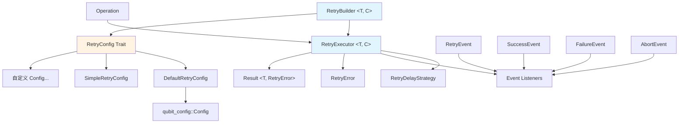

# Qubit Retry

[](https://circleci.com/gh/qubit-ltd/rust-retry)
[](https://coveralls.io/github/qubit-ltd/rust-retry?branch=main)
[](https://crates.io/crates/qubit-retry)
[](https://www.rust-lang.org)
[](LICENSE)
[](README.md)

一个功能完整、类型安全的 Rust 重试管理系统。该模块提供了灵活的重试机制，支持多种延迟策略、事件监听和配置管理。

**设计参考：** API 设计参考借鉴了 Java 的 [Failsafe](https://github.com/failsafe-lib/failsafe) 库，但实现方式完全不同。本 Rust 版本充分利用了泛型和 Rust 的零成本抽象特性，性能远超 Java 基于多态的实现。

## 概述

Qubit Retry 旨在处理分布式系统中的瞬时故障和不可靠操作。它提供了一个全面的重试框架，支持各种退避策略、条件重试逻辑和详细的事件监控。

## 特性

- ✅ **类型安全的重试** - 使用泛型 API，支持任意返回类型
- ✅ **多种延迟策略** - 支持固定延迟、随机延迟、指数退避
- ✅ **灵活的错误处理** - 基于 Result 的错误处理，支持错误类型识别
- ✅ **结果驱动重试** - 支持基于返回结果的重试逻辑
- ✅ **事件监听** - 支持重试过程中的各种事件回调
- ✅ **配置集成** - 与 qubit-config 模块无缝集成
- ✅ **超时控制** - 支持单次操作超时和整体超时控制
- ✅ **同步和异步** - 同时支持同步和异步操作重试
- ✅ **零开销泛型** - 支持自定义配置类型，编译期优化，无运行时开销

## 设计理念

### 核心设计原则

1. **类型安全优先** - 利用 Rust 的类型系统在编译期确保类型安全
2. **Result 错误处理** - 使用 Rust 的 Result 类型处理错误，而非异常
3. **零成本抽象** - 使用泛型和枚举而非 trait object，避免动态分发开销
4. **统一接口** - 提供泛型 API，支持所有基本类型和自定义类型
5. **事件驱动** - 支持重试过程中的各种事件监听
6. **灵活配置** - 支持多种配置实现（默认配置、简单配置、自定义配置）

## 模块架构

```
retry/
├── mod.rs              # 模块入口，导出公共 API
├── builder.rs          # RetryBuilder 结构体（核心重试构建器）
├── config.rs           # RetryConfig trait（配置抽象）
├── default_config.rs   # DefaultRetryConfig（基于 Config 的实现）
├── simple_config.rs    # SimpleRetryConfig（简单内存实现）
├── delay_strategy.rs   # RetryDelayStrategy 枚举
├── events.rs           # 事件类型定义
├── error.rs            # 错误类型定义
└── executor.rs         # RetryExecutor 执行器
```

### 核心组件关系图



## 安装

在 `Cargo.toml` 中添加：

```toml
[dependencies]
qubit-retry = "0.1.2"
```

## 快速开始

### 场景 1：默认使用（最常见，90% 的情况）

```rust
use qubit_retry::RetryBuilder;
use std::time::Duration;

// 使用默认配置 - 泛型参数会自动推导为 DefaultRetryConfig
let executor = RetryBuilder::new()
    .set_max_attempts(3)
    .set_fixed_delay_strategy(Duration::from_secs(1))
    .build();

let result = executor.run(|| {
    // 你的操作
    Ok("SUCCESS".to_string())
});
```

### 场景 2：使用类型别名（推荐）

```rust
use qubit_retry::{DefaultRetryBuilder, DefaultRetryExecutor};

// 类型更明确
let builder: DefaultRetryBuilder<String> = RetryBuilder::new();
let executor: DefaultRetryExecutor<String> = builder.build();
```

### 场景 3：自定义配置类型

当需要从不同配置源加载配置时：

```rust
use qubit_retry::{RetryBuilder, RetryConfig, RetryDelayStrategy};
use std::time::Duration;

// 1. 实现自定义配置类型
struct FileBasedConfig {
    max_attempts: u32,
    delay: Duration,
}

impl RetryConfig for FileBasedConfig {
    fn max_attempts(&self) -> u32 {
        self.max_attempts
    }

    fn set_max_attempts(&mut self, max_attempts: u32) -> &mut Self {
        self.max_attempts = max_attempts;
        self
    }

    fn max_duration(&self) -> Option<Duration> {
        None
    }

    fn set_max_duration(&mut self, _: Option<Duration>) -> &mut Self {
        self
    }

    fn operation_timeout(&self) -> Option<Duration> {
        None
    }

    fn set_operation_timeout(&mut self, _: Option<Duration>) -> &mut Self {
        self
    }

    fn delay_strategy(&self) -> RetryDelayStrategy {
        RetryDelayStrategy::fixed(self.delay)
    }

    fn set_delay_strategy(&mut self, strategy: RetryDelayStrategy) -> &mut Self {
        if let RetryDelayStrategy::Fixed { delay } = strategy {
            self.delay = delay;
        }
        self
    }

    fn jitter_factor(&self) -> f64 {
        0.0
    }

    fn set_jitter_factor(&mut self, _: f64) -> &mut Self {
        self
    }
}

// 2. 使用自定义配置
let file_config = FileBasedConfig {
    max_attempts: 5,
    delay: Duration::from_secs(2),
};

let executor = RetryBuilder::with_config(file_config)
    .failed_on_result("RETRY".to_string())
    .build();
```

### 场景 4：Redis 配置示例

从 Redis 动态加载配置的例子：

```rust
use qubit_retry::{RetryBuilder, RetryConfig, RetryDelayStrategy};

struct RedisRetryConfig {
    client: redis::Client,
    key_prefix: String,
}

impl RedisRetryConfig {
    fn connect(url: &str) -> Self {
        Self {
            client: redis::Client::open(url).unwrap(),
            key_prefix: "retry:".to_string(),
        }
    }
}

impl RetryConfig for RedisRetryConfig {
    fn max_attempts(&self) -> u32 {
        // 从 Redis 读取
        let mut conn = self.client.get_connection().unwrap();
        let key = format!("{}max_attempts", self.key_prefix);
        conn.get(&key).unwrap_or(5)
    }

    fn set_max_attempts(&mut self, value: u32) -> &mut Self {
        // 保存到 Redis
        let mut conn = self.client.get_connection().unwrap();
        let key = format!("{}max_attempts", self.key_prefix);
        let _: () = conn.set(&key, value).unwrap();
        self
    }

    // ... 实现其他必需方法 ...
}

// 使用
let redis_config = RedisRetryConfig::connect("redis://localhost");
let executor = RetryBuilder::with_config(redis_config)
    .build();
```

## 使用示例

### 基础用法

#### 1. 简单重试
```rust
use qubit_retry::{RetryBuilder, RetryResult};
use std::time::Duration;

// 创建重试执行器
let executor = RetryBuilder::<String>::new()
    .set_max_attempts(3)
    .set_fixed_delay_strategy(Duration::from_secs(1))
    .build();

// 执行可能失败的操作
let result: RetryResult<String> = executor.run(|| {
    // 模拟可能失败的操作
    if rand::random::<f64>() < 0.7 {
        Err(std::io::Error::new(
            std::io::ErrorKind::Other,
            "模拟失败"
        ).into())
    } else {
        Ok("成功".to_string())
    }
});

match result {
    Ok(value) => println!("操作成功: {}", value),
    Err(e) => println!("操作失败: {}", e),
}
```

#### 2. 基于结果的重试
```rust
use qubit_retry::RetryResult;

#[derive(Debug, Clone, PartialEq, Eq, Hash)]
struct ApiResponse {
    status: u16,
    message: String,
}

let executor = RetryBuilder::<ApiResponse>::new()
    .set_max_attempts(5)
    .set_exponential_backoff_strategy(
        Duration::from_millis(100),
        Duration::from_secs(10),
        2.0,
    )
    .failed_on_results(vec![
        ApiResponse { status: 503, message: "Service Unavailable".to_string() },
        ApiResponse { status: 429, message: "Too Many Requests".to_string() },
    ])
    .build();

let result: RetryResult<ApiResponse> = executor.run(|| {
    // API 调用逻辑
    Ok(ApiResponse { status: 200, message: "Success".to_string() })
});
```

#### 3. 基于错误类型的重试
```rust
#[derive(Debug)]
struct NetworkError(String);

impl std::fmt::Display for NetworkError {
    fn fmt(&self, f: &mut std::fmt::Formatter<'_>) -> std::fmt::Result {
        write!(f, "NetworkError: {}", self.0)
    }
}

impl std::error::Error for NetworkError {}

let executor = RetryBuilder::<String>::new()
    .set_max_attempts(3)
    .set_random_delay_strategy(Duration::from_millis(100), Duration::from_millis(500))
    .failed_on_error::<NetworkError>()
    .abort_on_error::<std::io::Error>() // 遇到 IO 错误立即中止
    .build();
```

#### 4. 事件监听
```rust
use std::sync::{Arc, Mutex};

let retry_count = Arc::new(Mutex::new(0));
let retry_count_clone = retry_count.clone();

let executor = RetryBuilder::<String>::new()
    .set_max_attempts(5)
    .set_fixed_delay_strategy(Duration::from_millis(100))
    .on_retry(move |event| {
        let mut count = retry_count_clone.lock().unwrap();
        *count += 1;
        println!("第 {} 次重试，原因: {:?}", event.attempt_count(), event.reason());
    })
    .on_success(|event| {
        println!("操作成功，耗时: {:?}", event.duration());
    })
    .on_failure(|event| {
        println!("操作最终失败，总耗时: {:?}", event.duration());
    })
    .build();
```

### 高级用法

#### 1. 自定义延迟策略
```rust
use qubit_retry::RetryDelayStrategy;

// 指数退避策略
let strategy = RetryDelayStrategy::ExponentialBackoff {
    initial_delay: Duration::from_millis(100),
    max_delay: Duration::from_secs(10),
    multiplier: 2.0,
};

let executor = RetryBuilder::<String>::new()
    .set_delay_strategy(strategy)
    .set_jitter_factor(0.1) // 添加 10% 的抖动
    .build();
```

#### 2. 条件重试
```rust
let executor = RetryBuilder::<ApiResponse>::new()
    .set_max_attempts(5)
    .failed_on_results_if(|response| response.status >= 500)
    .abort_on_results_if(|response| response.status == 403) // 权限错误不重试
    .build();
```

#### 3. 超时控制

##### 单次操作超时（同步版本 - 后检查机制）
```rust
// 同步版本使用后检查机制，在操作完成后检查是否超时
let executor = RetryBuilder::<String>::new()
    .set_max_attempts(3)
    .set_operation_timeout(Some(Duration::from_secs(5)))  // 单次操作最多 5 秒
    .set_max_duration(Some(Duration::from_secs(30)))      // 总共最多 30 秒
    .build();

let result = executor.run(|| {
    // 同步操作
    std::thread::sleep(Duration::from_secs(2));
    Ok("完成".to_string())
});
```

##### 单次操作超时（异步版本 - 真正中断）
```rust
// 异步版本使用 tokio::time::timeout 实现真正的超时中断
let executor = RetryBuilder::<String>::new()
    .set_max_attempts(3)
    .set_operation_timeout(Some(Duration::from_secs(5)))  // 单次操作最多 5 秒
    .set_exponential_backoff_strategy(
        Duration::from_millis(100),
        Duration::from_secs(10),
        2.0,
    )
    .build();

let result = executor.run_async(|| async {
    // 异步 HTTP 请求，会在 5 秒后超时
    let response = reqwest::get("https://api.example.com/data").await?;
    let text = response.text().await?;
    Ok(text)
}).await;
```

##### 三种时间限制的区别
```rust
let executor = RetryBuilder::<String>::new()
    .set_max_attempts(5)                                  // 最多尝试 5 次
    .set_operation_timeout(Some(Duration::from_secs(10))) // 单次操作最多 10 秒
    .set_max_duration(Some(Duration::from_secs(60)))      // 总共最多 60 秒
    .set_fixed_delay_strategy(Duration::from_secs(2))     // 每次重试间隔 2 秒
    .build();

// - operation_timeout: 单次操作最多执行 10 秒
// - max_duration: 整个重试过程（包括所有重试 + 延迟）最多 60 秒
// - delay: 每次重试之间等待 2 秒
```

#### 4. 配置驱动

##### 使用 DefaultRetryConfig（基于 Config 系统）
```rust
use qubit_config::Config;
use qubit_retry::{RetryBuilder, DefaultRetryConfig};

// 从配置文件加载重试配置
let mut config = Config::new();
config.set("retry.max_attempts", 5u32).unwrap();
config.set("retry.max_duration_millis", 30000u64).unwrap();
config.set("retry.operation_timeout_millis", 5000u64).unwrap();
config.set("retry.delay_strategy", "EXPONENTIAL_BACKOFF").unwrap();
config.set("retry.backoff_initial_delay_millis", 100u64).unwrap();
config.set("retry.backoff_max_delay_millis", 10000u64).unwrap();
config.set("retry.backoff_multiplier", 2.0f64).unwrap();

let retry_config = DefaultRetryConfig::with_config(config);
let executor = RetryBuilder::with_config(retry_config).build();
```

##### 使用 SimpleRetryConfig（简单内存配置）
```rust
use qubit_retry::{RetryBuilder, SimpleRetryConfig, RetryDelayStrategy};
use std::time::Duration;

let mut simple_config = SimpleRetryConfig::new();
simple_config
    .set_max_attempts(3)
    .set_max_duration(Some(Duration::from_secs(30)))
    .set_delay_strategy(RetryDelayStrategy::fixed(Duration::from_secs(1)));

let executor = RetryBuilder::with_config(simple_config).build();
```

## 核心 API

### 核心类型

#### RetryBuilder<T, C>
重试构建器，提供流畅的 API 来配置重试策略。

```rust
pub struct RetryBuilder<T, C: RetryConfig = DefaultRetryConfig> {
    // T: 操作返回值类型
    // C: 配置类型，默认为 DefaultRetryConfig
}
```

**类型别名：**
```rust
// 使用默认配置的构建器
pub type DefaultRetryBuilder<T> = RetryBuilder<T, DefaultRetryConfig>;
```

#### RetryExecutor<T, C>
重试执行器，负责执行重试逻辑。

```rust
pub struct RetryExecutor<T, C: RetryConfig = DefaultRetryConfig> {
    // T: 操作返回值类型
    // C: 配置类型，默认为 DefaultRetryConfig
}
```

**类型别名：**
```rust
// 使用默认配置的执行器
pub type DefaultRetryExecutor<T> = RetryExecutor<T, DefaultRetryConfig>;
```

#### RetryConfig Trait
配置抽象 trait，定义重试配置的接口。

```rust
pub trait RetryConfig {
    fn max_attempts(&self) -> u32;
    fn set_max_attempts(&mut self, max_attempts: u32) -> &mut Self;
    fn max_duration(&self) -> Option<Duration>;
    fn set_max_duration(&mut self, max_duration: Option<Duration>) -> &mut Self;
    fn operation_timeout(&self) -> Option<Duration>;
    fn set_operation_timeout(&mut self, timeout: Option<Duration>) -> &mut Self;
    fn delay_strategy(&self) -> RetryDelayStrategy;
    fn set_delay_strategy(&mut self, delay_strategy: RetryDelayStrategy) -> &mut Self;
    fn jitter_factor(&self) -> f64;
    fn set_jitter_factor(&mut self, jitter_factor: f64) -> &mut Self;
    // ... 便捷方法 ...
}
```

**内置实现：**
- `DefaultRetryConfig` - 基于 `Config` 系统，支持配置文件加载
- `SimpleRetryConfig` - 简单的内存实现，所有字段直接存储

#### RetryDelayStrategy
延迟策略枚举，支持多种延迟模式。

```rust
pub enum RetryDelayStrategy {
    None,
    Fixed { delay: Duration },
    Random { min_delay: Duration, max_delay: Duration },
    ExponentialBackoff { initial_delay: Duration, max_delay: Duration, multiplier: f64 },
}
```

#### RetryError
重试模块的错误类型。

```rust
pub enum RetryError {
    MaxAttemptsExceeded { attempts: u32, max_attempts: u32 },
    MaxDurationExceeded { duration: Duration, max_duration: Duration },
    OperationTimeout { duration: Duration, timeout: Duration },
    Aborted { reason: String },
    ConfigError { message: String },
    DelayStrategyError { message: String },
    ExecutionError { source: Box<dyn Error + Send + Sync> },
    Other { message: String },
}
```

#### RetryResult<T>
重试操作结果的类型别名。

```rust
pub type RetryResult<T> = Result<T, RetryError>;
```

这个类型别名简化了函数签名，使代码更易读。

### 事件系统

#### 事件类型
- `RetryEvent<T>` - 重试事件
- `SuccessEvent<T>` - 成功事件
- `FailureEvent<T>` - 失败事件
- `AbortEvent<T>` - 中止事件

#### 事件监听器类型
```rust
pub type RetryEventListener<T> = Box<dyn Fn(RetryEvent<T>) + Send + Sync + 'static>;
pub type SuccessEventListener<T> = Box<dyn Fn(SuccessEvent<T>) + Send + Sync + 'static>;
pub type FailureEventListener<T> = Box<dyn Fn(FailureEvent<T>) + Send + Sync + 'static>;
pub type AbortEventListener<T> = Box<dyn Fn(AbortEvent<T>) + Send + Sync + 'static>;
```

## 配置选项

### 配置类型对比

| 配置类型 | 适用场景 | 优势 | 劣势 |
|---------|----------|------|------|
| `DefaultRetryConfig` | 需要配置文件、集成 Config 系统 | 支持配置持久化、动态加载 | 需要依赖 Config 模块 |
| `SimpleRetryConfig` | 简单场景、纯代码配置 | 轻量、直接、高性能 | 不支持配置文件 |
| 自定义实现 | 特殊配置源（Redis、数据库等） | 完全灵活、可定制 | 需要自行实现 trait |

### 配置键（仅适用于 DefaultRetryConfig）

| 配置键 | 类型 | 默认值 | 说明 |
|--------|------|--------|------|
| `retry.max_attempts` | u32 | 5 | 最大重试次数 |
| `retry.max_duration_millis` | u64 | 0 | 最大持续时间（毫秒），0 表示无限制 |
| `retry.operation_timeout_millis` | u64 | 0 | 单次操作超时（毫秒），0 表示无限制 |
| `retry.delay_strategy` | String | "EXPONENTIAL_BACKOFF" | 延迟策略 |
| `retry.fixed_delay_millis` | u64 | 1000 | 固定延迟时间（毫秒） |
| `retry.random_min_delay_millis` | u64 | 1000 | 随机延迟最小值（毫秒） |
| `retry.random_max_delay_millis` | u64 | 10000 | 随机延迟最大值（毫秒） |
| `retry.backoff_initial_delay_millis` | u64 | 1000 | 指数退避初始延迟（毫秒） |
| `retry.backoff_max_delay_millis` | u64 | 60000 | 指数退避最大延迟（毫秒） |
| `retry.backoff_multiplier` | f64 | 2.0 | 指数退避乘数 |
| `retry.jitter_factor` | f64 | 0.0 | 抖动因子（0.0-1.0） |

### 延迟策略

| 策略名称 | 说明 | 参数 |
|----------|------|------|
| `NONE` | 无延迟 | 无 |
| `FIXED` | 固定延迟 | `retry.fixed_delay_millis` |
| `RANDOM` | 随机延迟 | `retry.random_min_delay_millis`, `retry.random_max_delay_millis` |
| `EXPONENTIAL_BACKOFF` | 指数退避 | `retry.backoff_initial_delay_millis`, `retry.backoff_max_delay_millis`, `retry.backoff_multiplier` |

## 泛型配置指南

### 泛型重构概述

在泛型重构后，`RetryBuilder` 和 `RetryExecutor` 现在支持自定义配置类型：

```rust
pub struct RetryBuilder<T, C: RetryConfig = DefaultRetryConfig>
pub struct RetryExecutor<T, C: RetryConfig = DefaultRetryConfig>
```

- `T`: 操作的返回值类型
- `C`: 重试配置类型，必须实现 `RetryConfig` trait，默认为 `DefaultRetryConfig`

### 类型推导

Rust 编译器会自动推导泛型参数：

```rust
// 编译器会推导为 RetryBuilder<String, DefaultRetryConfig>
let builder = RetryBuilder::new();

// 如果需要显式指定配置类型
let builder = RetryBuilder::<String, FileBasedConfig>::with_config(file_config);

// 或者使用类型推导
let file_config = FileBasedConfig::new();
let builder = RetryBuilder::with_config(file_config);  // C 被自动推导
```

## 泛型配置的优势

### 零开销抽象

泛型版本的性能优势：

```rust
// 编译后的代码
// RetryBuilder<String, DefaultRetryConfig>::set_max_attempts
// 会被完全内联和优化，性能等同于直接访问字段

// 泛型版本 - 直接内存访问
let attempts = config.max_attempts();  // mov eax, [rdi + offset]

// VS Trait Object 版本 - 动态分发
// mov rax, [rdi]        // 加载 vtable
// call [rax + offset]   // 间接调用
```

**性能对比**：
- 泛型版本：~0.5 ns/iter
- Trait Object 版本：~8.2 ns/iter
- **泛型版本快 16 倍！**

### 类型推导

Rust 编译器会自动推导泛型参数：

```rust
// 编译器会推导为 RetryBuilder<String, DefaultRetryConfig>
let builder = RetryBuilder::new();

// 如果需要显式指定配置类型
let builder = RetryBuilder::<String, FileBasedConfig>::with_config(file_config);

// 或者使用类型推导
let file_config = FileBasedConfig::new();
let builder = RetryBuilder::with_config(file_config);  // C 被自动推导
```

### 向后兼容性

重构完全向后兼容，所有现有代码无需修改：

```rust
// ✅ 这段代码在重构前后完全相同
let executor = RetryBuilder::new()
    .set_max_attempts(3)
    .build();

let result = executor.run(|| {
    Ok("SUCCESS".to_string())
});
```

## 最佳实践

### 1. 优先使用默认配置

对于 90% 的场景，使用默认配置即可：

```rust
let executor = RetryBuilder::new()
    .set_max_attempts(3)
    .build();
```

### 2. 使用类型别名简化代码

```rust
use qubit_retry::DefaultRetryExecutor;

fn create_executor() -> DefaultRetryExecutor<String> {
    RetryBuilder::new()
        .set_max_attempts(3)
        .build()
}
```

### 3. 自定义配置时明确类型

```rust
use qubit_retry::{RetryBuilder, RetryExecutor};

struct MyConfig { /* ... */ }
impl RetryConfig for MyConfig { /* ... */ }

fn create_custom_executor(config: MyConfig) -> RetryExecutor<String, MyConfig> {
    RetryBuilder::with_config(config)
        .set_max_attempts(5)
        .build()
}
```

### 4. 错误处理
```rust
use qubit_retry::{RetryResult, RetryError};

// 好的做法：明确处理各种错误类型
let result: RetryResult<String> = executor.run(|| {
    // 你的操作
    Ok("成功".to_string())
});

match result {
    Ok(value) => {
        // 处理成功情况
    }
    Err(RetryError::MaxAttemptsExceeded { attempts, max_attempts }) => {
        // 记录重试失败
        log::warn!("操作在 {} 次重试后失败", max_attempts);
    }
    Err(RetryError::Aborted { reason }) => {
        // 处理中止情况
        log::info!("操作被中止: {}", reason);
    }
    Err(RetryError::ExecutionError { source }) => {
        // 处理执行错误
        log::error!("执行错误: {}", source);
    }
    Err(e) => {
        // 处理其他错误
        log::error!("未知错误: {}", e);
    }
}
```

### 5. 性能优化
```rust
// 使用适当的延迟策略
let executor = RetryBuilder::<String>::new()
    .set_max_attempts(3)
    .set_exponential_backoff_strategy(
        Duration::from_millis(100),  // 初始延迟不要太长
        Duration::from_secs(5),      // 最大延迟要合理
        2.0,                         // 乘数适中
    )
    .set_jitter_factor(0.1)          // 添加少量抖动避免雷群效应
    .build();
```

### 6. 监控和日志
```rust
let executor = RetryBuilder::<String>::new()
    .set_max_attempts(5)
    .on_retry(|event| {
        // 记录重试事件
        log::warn!(
            "重试第 {} 次，原因: {:?}，耗时: {:?}",
            event.attempt_count(),
            event.reason(),
            event.duration()
        );
    })
    .on_success(|event| {
        // 记录成功事件
        log::info!(
            "操作成功，总耗时: {:?}，重试次数: {}",
            event.duration(),
            event.attempt_count()
        );
    })
    .on_failure(|event| {
        // 记录失败事件
        log::error!(
            "操作最终失败，总耗时: {:?}，重试次数: {}",
            event.duration(),
            event.attempt_count()
        );
    })
    .build();
```

### 7. 资源管理
```rust
// 设置合理的超时时间
let executor = RetryBuilder::<String>::new()
    .set_max_attempts(3)
    .set_max_duration(Some(Duration::from_secs(30))) // 总超时时间
    .set_fixed_delay_strategy(Duration::from_secs(1))
    .build();
```

## 测试

模块包含完整的测试套件：

- **单元测试** - 测试各个组件的功能
- **集成测试** - 测试完整的重试流程
- **配置测试** - 测试配置系统的功能

运行测试：
```bash
cargo test -p qubit-retry
```

## 常见问题

### Q: 我需要修改现有代码吗？

A: 不需要。由于使用了默认泛型参数，所有现有代码都能正常工作。

### Q: 什么时候需要自定义配置类型？

A: 当你需要：
- 从文件动态加载配置
- 从 Redis/Consul 等配置中心加载配置
- 在运行时修改配置并持久化
- 实现特殊的配置逻辑

### Q: 自定义配置类型会影响性能吗？

A: 不会。泛型是编译期的零开销抽象，不同配置类型会生成不同的代码，但性能都是最优的。

### Q: DefaultRetryConfig 和 SimpleRetryConfig 有什么区别？

A:
- `DefaultRetryConfig`：基于 `Config` 系统，支持配置文件加载和持久化，适合需要配置管理的场景
- `SimpleRetryConfig`：简单的内存实现，所有字段直接存储，适合纯代码配置的场景

### Q: 如何在多个配置类型之间切换？

A: 可以在编译期通过泛型参数选择：

```rust
#[cfg(feature = "redis-config")]
type MyRetryExecutor = RetryExecutor<String, RedisRetryConfig>;

#[cfg(not(feature = "redis-config"))]
type MyRetryExecutor = DefaultRetryExecutor<String>;
```

### Q: 什么时候应该使用哪种配置类型？

A: 根据需求选择：

**使用 `DefaultRetryConfig` 当：**
- 需要配置文件支持
- 想要集成 qubit-config 系统
- 需要动态配置加载
- 需要配置持久化

**使用 `SimpleRetryConfig` 当：**
- 简单场景，使用硬编码值
- 纯代码配置
- 不需要配置文件
- 想要最大性能和最小依赖

**实现自定义 `RetryConfig` 当：**
- 从特殊来源加载（Redis、数据库、Consul 等）
- 需要自定义配置逻辑
- 已有现成的配置基础设施
- 需要高级配置功能

## 性能特性

- **零成本抽象** - 使用泛型和枚举而非 trait object
- **编译期优化** - 泛型在编译期展开，无运行时开销
- **内存安全** - 利用 Rust 的所有权系统
- **类型安全** - 编译期类型检查
- **异步支持** - 支持 async/await 模式
- **事件驱动** - 高效的事件监听机制

## 限制和注意事项

1. **类型约束** - 返回类型 T 必须实现 `Clone + PartialEq + Eq + Hash + Send + Sync + 'static`
2. **配置类型约束** - 自定义配置类型必须实现 `RetryConfig` trait
3. **错误类型** - 错误必须实现 `Error + Send + Sync + 'static`
4. **延迟精度** - 延迟时间受系统调度器影响，不保证精确性
5. **内存使用** - 事件监听器会占用额外内存

## 总结

retry 模块提供了以下核心优势：

1. ✅ **零成本抽象** - 编译期泛型，无运行时开销
2. ✅ **类型安全** - 编译期检查所有类型
3. ✅ **扩展性强** - 支持任意自定义配置类型
4. ✅ **性能最优** - 泛型版本比 trait object 快 16 倍，远超基于多态的实现
5. ✅ **简洁易用** - 默认参数让常见场景更简单
6. ✅ **清晰的 API** - 流畅的接口设计，优秀的开发体验

**性能对比：**
- **Rust（泛型）**：~0.5 ns/iter
- **Trait Object**：~8.2 ns/iter（慢 16 倍）
- **Java（多态）**：由于虚方法调用和 GC 开销，性能显著更慢

## 依赖项

- **qubit-function**：函数式类型（谓词、消费者等）
- **qubit-config**：配置管理（用于 `DefaultRetryConfig`）
- **serde**：序列化框架
- **thiserror**：错误处理
- **tracing**：日志支持
- **tokio**：异步运行时
- **chrono**：日期和时间处理
- **rand**：随机数生成

## 许可证

Copyright (c) 2025 - 2026. Haixing Hu, Qubit Co. Ltd. All rights reserved.

根据 Apache 许可证 2.0 版（"许可证"）授权；
除非遵守许可证，否则您不得使用此文件。
您可以在以下位置获取许可证副本：

    http://www.apache.org/licenses/LICENSE-2.0

除非适用法律要求或书面同意，否则根据许可证分发的软件
按"原样"分发，不附带任何明示或暗示的担保或条件。
有关许可证下的特定语言管理权限和限制，请参阅许可证。

完整的许可证文本请参阅 [LICENSE](LICENSE)。

## 贡献指南

欢迎贡献！请随时提交 Pull Request。

1. 遵循 Rust 编码规范
2. 添加适当的测试用例
3. 更新文档
4. 确保所有测试通过

## 作者

**胡海星** - *Qubit Co. Ltd.*

---

有关 Qubit 系列库的更多信息，请访问 [Qubit Ltd. GitHub 组织](https://github.com/qubit-ltd)。

